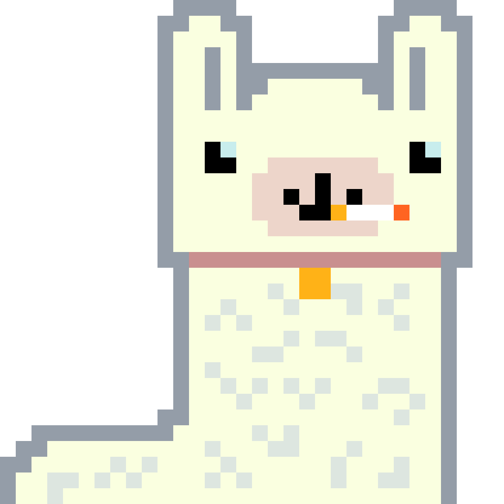

# simpleNFT - Cryptic Llamas
**NB! Code is hacky and done in non-standard ways some places. This is done to maximize the fun I had while working on it. For a bigger project, or a more professional one, you might want to use something like Truffle instead. Planned to release it (called Cryptic Llamas), but minting NFTs can be expensive. Releasing it in the open in case someone can learn from it. While you will probably learn more from more standard ways of doing things, I always have more fun reading non-standard code myself :)**

Simple NFT project from scratch. Using a basic setup and an excuse to play with Web3j, and not big JavaScript project structures. Planning on using KScript, bash and super simple stuff instead (not recommended for big projects, done as a fun challenge).

Feel free to experiment with the scripts if you can get any use from them :) I created this for fun late in the evenings, so the code is far from perfect. My goal was more having fun with a lot of different libraries and technologies I think are cool.

## Goals
My goals for this project are as following:
- Simplest possible project setup. Scripts doing most of the work (NOT GOOD FOR BIGGER PROJECTS, use real tools like Truffle and various NPM tools instead)
- Hopefully the steps might be educational for someone reading this... A simple small project will show how easy and minimal it is to create your own NFTs.
- Experiment a bit with Ethereum smart contracts (even though they are super simple in this case). Looking into OpenZeppelin and other libraries that might be useful.
- Actually release the project on something like OpenSea
- Very simple pixel art graphics, complete NFT generated programatically from components. Including the code, everything should be completable within a week (outside of my 9-5 working hours). 
- Use IPFS (possibly [Pinata](https://www.pinata.cloud/)) to host the images, instead of a regular website (which can be mutated/changed)

## Tools needed
### Software
- Ganache (local only)
- KScript
- Web3j cli
- jbang (to export generated Java file from web3j as a Maven dependency that is usable in KScript)
- curl and wget
- sed
- jq

**NB! If endToEnd.sh is run multiple times, remember to clear the KScript cache to avoid it caching the Web3j generated Maven dependency.**

## Services
You also need a [Pinata](https://www.pinata.cloud/) JWT to be able to upload the file to IPFS. You can tweak the scripts to use other IPFS pinning services if you want to.

If you want to deploy to testnet or mainnet, a gateway service (to get a valid HTTP endpoint) is required. I use [Alchemy](https://www.alchemy.com/) for this purpose. 

## How to run
To run the complete flow, use the endToEnd.sh script. Populate the necessary variables PINATA_JWT, WALLET_PRIVATE_KEY, and BLOCKCHAIN_URL (last one gotten from a place like Infura or Alchemy). Skip the blockchain URL if you are deploying to a local blockchain using something like [Ganache](https://www.trufflesuite.com/ganache) (you might have to tweak the port it is running on to be the one the Web3j client expects, 8545).

You also need a directory called components with subdirectories body, face_accessories, head_accessories, and neck_accessories. The program will then put these together into randomized images of Llamas (or something other you might try). Example of generated image is at the top of the readme. Not releasing the components themselves, as there are always someone who don't want to do work themselves and just release something someone else created... (even though they are just very simple pixelated images). (combination = white llama, no head accessories, cigarette, and collar). 
